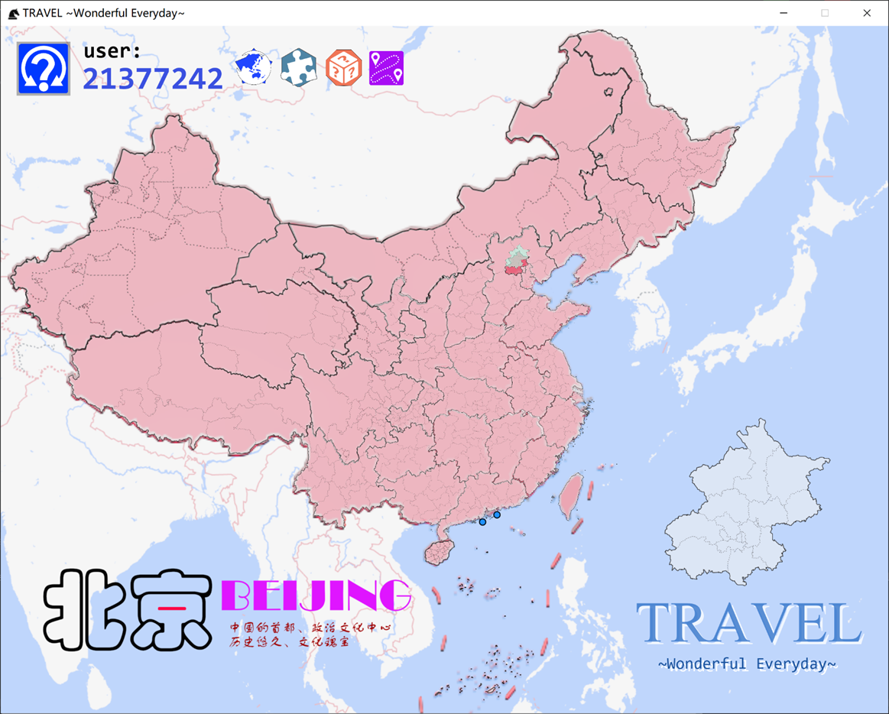
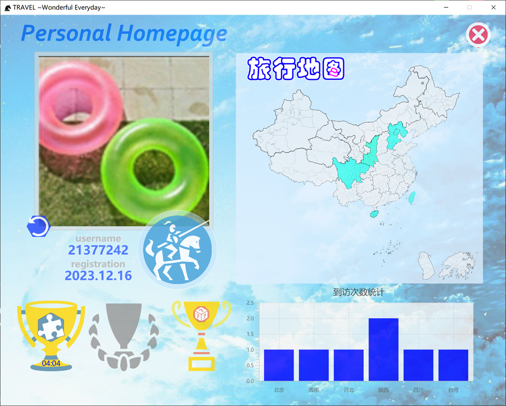
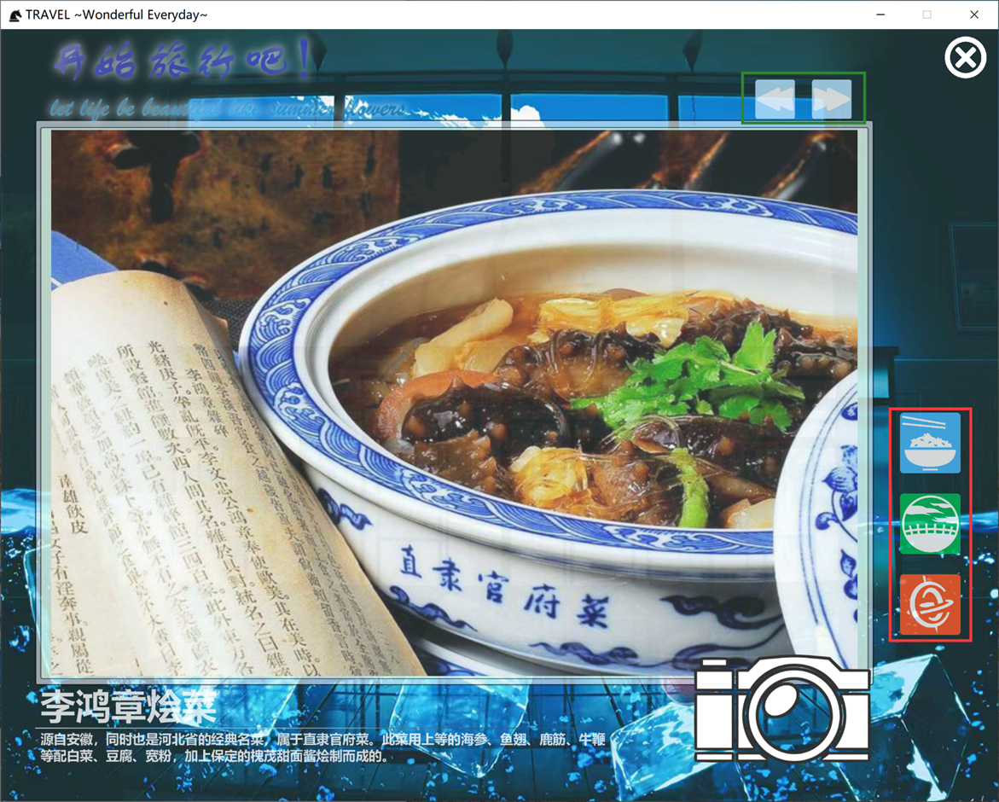
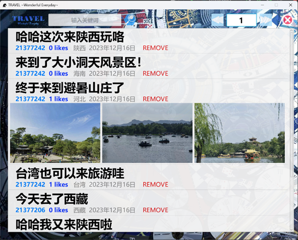
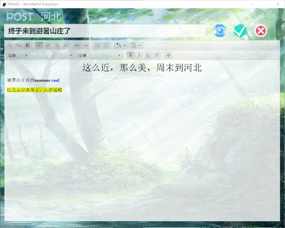
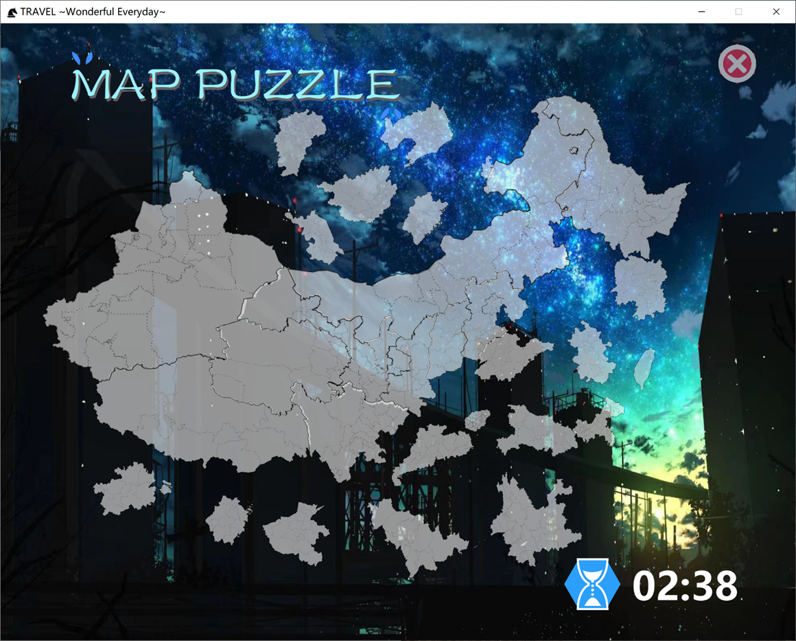
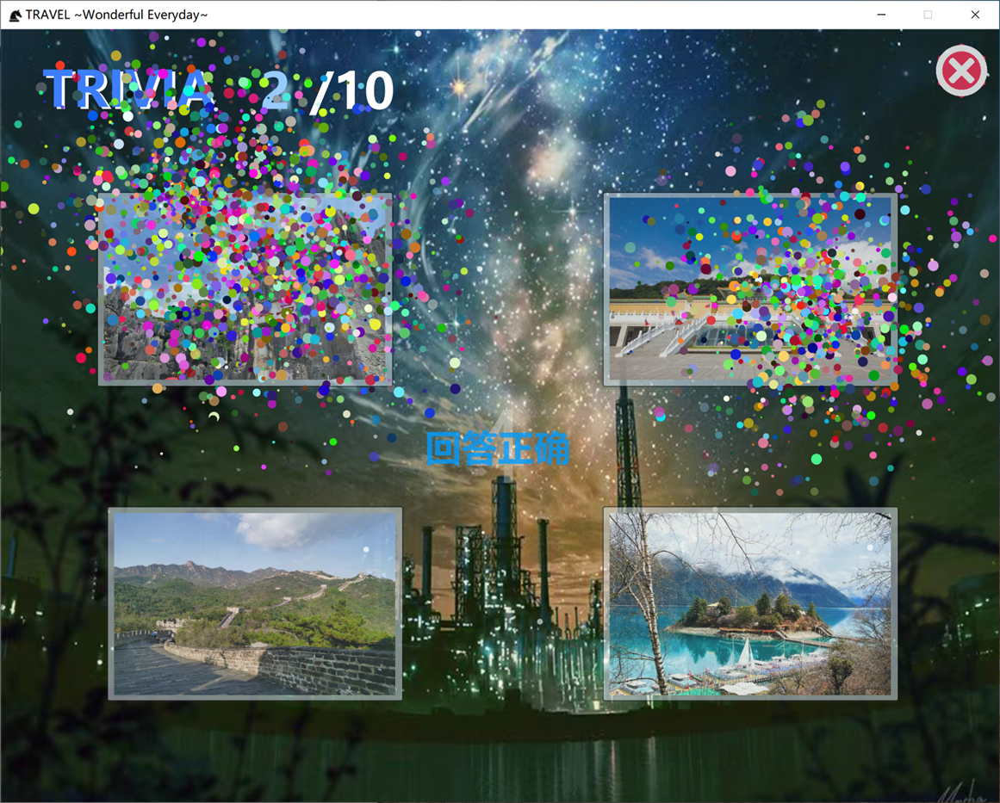

# Let's Travel

## Introduction

Let's Travel是由**javaFX+Scene Builder+Http Client+Nginx+reptile**等技术实现的旅行者论坛

包括但不限于以下功能：

- **完整的登录注册、找回密码功能，权限分为用户和管理员；**
- **主界面由中国地图构成，鼠标悬浮其上有灵动效果，点击可展示各省市的详细介绍，包括风景名胜、特色美食、地方民俗等**
- **论坛部分支持富文本编辑发帖，支持上传图片，点赞评论及多级回复，支持按关键字搜索；**
- **初基本论坛功能外，包含地理拼图，图片省份匹配，简易路径规划等趣味功能；**
- **个人中心包括个人信息展示，趣味发帖数据统计等功能。**

[//]: # ([![CI]&#40;https://github.com/WinterChenS/my-site/actions/workflows/main.yml/badge.svg&#41;]&#40;https://github.com/WinterChenS/my-site/actions/workflows/main.yml&#41;)

# Quick Start

在 `src/main/java/app/App.java` 中运行 `app.main()` 即可

# Preview

**登陆注册：**

**首页&个人主页：**

**各省详情：**

**论坛界面：**

**趣味游戏：**

